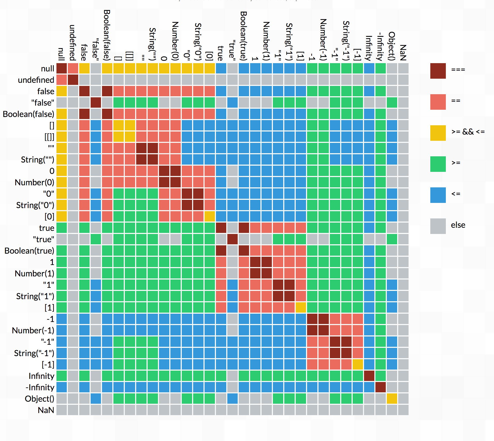

# Sticky Javascript

## Data types
There are **7** primitive types in Javascript: `string`, `number`, `bigint`, `boolean`, `symbol`, `null` and `undefined`, while `object` is special.  

|Data type|Internal represention|
|-|:-:|
|`string`|[UTF-16](https://en.wikipedia.org/wiki/UTF-16) characters|
|`number`|[IEEE-754](https://en.wikipedia.org/wiki/IEEE_754) 64-bit, equally `double` in C/C++|
|`bigint`|Integer in ±2<sup>53</sup>-1|
|`boolean`|`true`/`false`|
|`symbol`|Unique identifier created from `Symbol()`
|`null`|Empty or unknown value|
|`undefined`|Unassigned value|
|`object`|Keyed collections of various data|

🛈  `null` is used to represent absence of any object value, while `undefined` means "value is not assigned" and **should not** be used directly  
</br>
**Primitive** are copied by value.
```javascript
let a = "Hello, World!";
let b = a; // a and b are now independent.
```
`object` are copied "by reference".
```javascript
let a = {user: "Alice", money: 1000};
let b = a; // a and b share the reference of the same object.
```

🛈 `typeof(x)` can be used to find the type of argument `x`

## Integer-string conversion
#### String concatenation with binary +
If any of the operands is a string, then the other one is converted to string.
```javascript
"1" + 2 // "12"
1 + "2" // "12"
```
The first `+` sums two numbers, so it returns `4`, then the next `+` adds the string `"2"` to it.
```javascript
2 + 2 + "2" // "42" and not "221", from left to right
```

The first operand is a string, the compiler treats the other two operands as strings too. The 2 gets concatenated to '1'.
```javascript
"2" + 2 + 2 // "222" and not "24"
```
The binary `+` is the only operator that supports strings in such a way. Other arithmetic operators work only with numbers and always convert their operands to numbers.
```javascript
6 - "2" // 4, "2" is converted to number
"6" / "2" // 3, both "6" and "2" are converted to numbers
```

#### Numberic conversion with unary +
Unary `+` converts string to number
```javascript
+"1" // 1
+"-2" // -2
+true // 1
+"abc" // NaN, invalid number represention
```
⚠  `""`, `null` and `undefined` are special case in numberic conversion  

|Expression|Result|
|-|-|
|`+""`|`0`|
|`+null`|`0`|
|`+undefined`|`NaN`|

🛈  `NaN` represents an value that is undefined or unrepresentable, defined in [IEEE 754](https://en.wikipedia.org/wiki/IEEE_754)  

## Boolean conversion
Values that are "empty", like 0, an empty string, `null`, `undefined`, and `NaN`, become `false`, also called **falsy value**.  
Otherwise, is `true`, also called **truthy value**  
```javascript
Boolean("some") // true
Boolean("0") // true, non-empty string
```

## Comparison of different types
When comparing string to number, Javascript converts string to number
```javascript
"2" > 1 // 2 > 1, true
10 > "03" // 10 > 3, true
```

**The conditional logic in Javascript is just confused and erroneous.**  
</br>
Table 1: Truth Table


## OR operator ||
`||` operator finds the **first** truthy value, not just `true`/`false`.  
If all falsy value, return the last value.  
```javascript
false || true // true
false || false // false
let a = "" || false || "apple"; // "apple"
let b = null || "" // "", all falsy value, return the last value
```

## AND operator &&
`&&` operator finds the **first** falsy value, not just `true`/`false`.  
If all trusy value, return the last value.  
```javascript
false && true // false
true && false // false
let a = "apple" && null && "apple"; // null
let b = "apple" && 114154 // 114154, all trusy value, return the last value
```
Both `||` and `&&` have short-circuit evaluation. That is, these operators processes its arguments until the first truthy/falsy value is found, and then the value is returned immediately.  

## Double NOT operator !!
`!!` converts its operand to `boolean`.  

## Nullish coalescing operator ??
The result of `a ?? b`:  
If `a` defined, not `null` or `undefined`, then `a`.  
Otherwise, `b`.  
```javascript
// Example 1
let a; // undefined
a ?? "b" // "b"
```
⚠  `undefined` ≠ not defined variable, variable must be declared before use.  
</br>
*Last updated on 9 May, 2022*  
